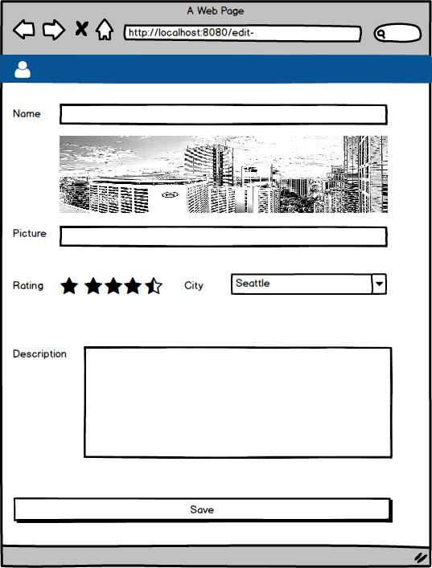

# 09 Form Excercise

In this example we are going to implement a new page to edit hotel details.

The flow to reach that page:
  - User logins.
  - List of hotels is displayed.
  - The user click on the pencil icon on one of the hotel cards.
  - The application navigates to a new page passing by parameter the id of the hotel to be edited.

# Form

form mock to be implemented

Form Validations to be implemented:

- Name:
   - Required field
  
- Picture:
   - Required field
   - Must be a picture
   - [bonus] Async validation file exists
- Rating: 
   - Required field.
   - Must be greater than 2.
- City:
   - Required field.
- Description: 
   - Required filed.
   - MinLength: 24 Characters.
   - MaxLenght: 256 Characters.

# Adding testing support

Check this guide:

https://github.com/Lemoncode/jest-testing-by-sample/blob/master/frontend/01%20Add%20config/README.md

You have to setup aliases in Jest as well:

https://www.basefactor.com/configuring-aliases-in-webpack-vs-code-typescript-jest

We will start by testing custom 

# Tips / Guide

- Start by create the hotel-edit scene.
- Create the right route (including the hotel param Id).
- Create the navigation from the hotel list (card pencil
icon) to the hotel edit new page (passing as parameter in
the querystring the selected hotel id).
- **CHECK** ensure the navigation is working as expected.
- We should manage the selected hotel Id in the scene it
self and pass it to the container in the hotel pod (next step).
- Let's crete the hotel-edit pod.
- Inside that pod create a container and a component and
link it to the scene.
- Now it's time to define a ViewModel.
- Let's build the layout of the form (should we 
componentize it?).
  - You will need to find material ui rate widget.
  - You will need to check how a dropdown in material ui
  works.
- Let's include harcoded data in the form.
- Let's bind all data.
- Let's add the plumbing for the edition.
- Check that clicking _save_ you just output in the console
all the updated data.
- Let's go for validations:
   - Hotel name is required, plus lenght should be greater than two letters.
   - Picture is required.
   - Rating is required and cannot below two stars (we will need to create a wrapper for this control to display errors).
   - User must choose a city (we will need to create a wrapper for combos, displaying form errors).
   - Description cannot be empty.
- Now it's time to implement the real hotel data retrieval (api) and remove the mock data (we will
need to create mappers to map between api entity and vm entity).
- Once we are done let's make post/put update (save).

# Extras

- Make this interface responsive.

